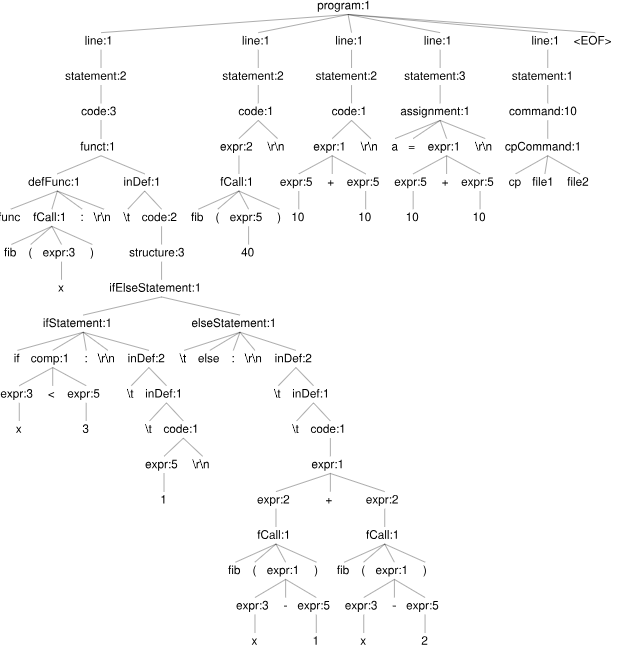

# Proyecto Final Teoría de Compiladores

# Shell X

## Lenguaje básico de scripting
Con estructuras repetitivas, condicionales y selectivas, variables ylistas.

* Ejemplo de lenguaje
    * Usar tab para la función. (En Markdown se está traduciendo a cuatro espacios).
    ```bash
    func fib(x):
        if x < 3 :
            1
        else:
            fib(x-1) + fib(x-2)

    fib(40)
    10+10
    a = 10 + 10
    cp file1 file2
    ```
    * Árbol Sintáctico resultante <br/>
    

* Ejemplo de estructura repetitiva
```bash
for n in {1..10}
do:
echo hola
:done
```

## Tratamiento de variables de entorno
* pwd : indica el directorio actual `pwdCommand: PWD NEWLINE?`

## Acceso a comandos de sistema
Se han considerado los siguientes comandos del sistema a ser ejecutados por el shell:
* ls : lista los archivos `LS (flags)? (ARG | VAR)* NEWLINE?`
* cat : ver el contenido de uno o más archivos `CAT (flags)? (ARG | VAR)* NEWLINE?`
* mv : mover o renombrar archivos `MV (flags)? (ARG | VAR)* NEWLINE?`
* touch : crear uno o más archivos `TOUCH (flags)? (ARG | VAR)* NEWLINE?`
* echo : devuelve el valor retornado del último comando `ECHO (flags)? (ARG | VAR)* NEWLINE?`
* rm : elimina uno o más archivos `RM (flags)? (ARG | VAR)* NEWLINE?`
* mkdir : crea uno o más directorios / carpetas `MKDIR (flags)? (ARG | VAR)* NEWLINE?`
* grep : busca una palabra en un archivo o más `GREP (flags)? (ARG | VAR)* NEWLINE?`;
* cp : copia un archivo o más `CP (flags)? (ARG | VAR)* NEWLINE?`;

## Modo interactivo
<!-- , el cual es el modo principal, permite mostrar un prompt definido en lavariable PS1 o PROMPT -->
* Se actuva al invocar ./a.out sin un archivo al lado
* Interpreta comandos de sistema, acceso a variables de entorno y operaciones simples.

# Ejecución:
* Requiere instalación de [antlr4 Java runtime](https://www.antlr.org/)
* Generar las librerías:
    ```bash
    antlr4 -o src/ ShellX.g4 -Dlanguage=Cpp -no-listener -visitor
    g++ main.cpp src/*.cpp ShellXVisitorImpl.cpp -IANTLRI -lantlr4-runtime
    ```

    * Puede omitirse -IANTLRI. Sin embargo, de salir errores, incluirlo.
    * ANTLRI es una variable de entorno.
        * Ejemplo: `/usr/local/include/antlr4-runtime`
        * También puede ser reemplazado por el directorio en sí directamente


# Video
[Presentación](https://youtu.be/YQY8BbYKArA)
